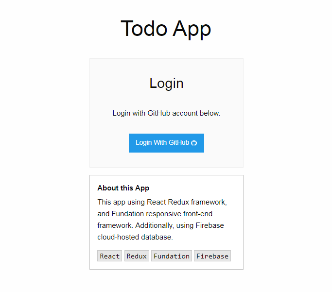
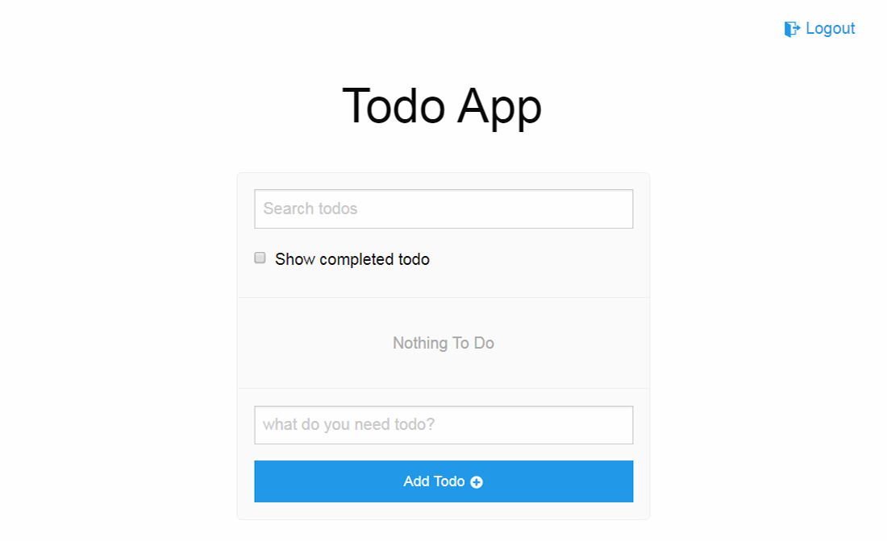
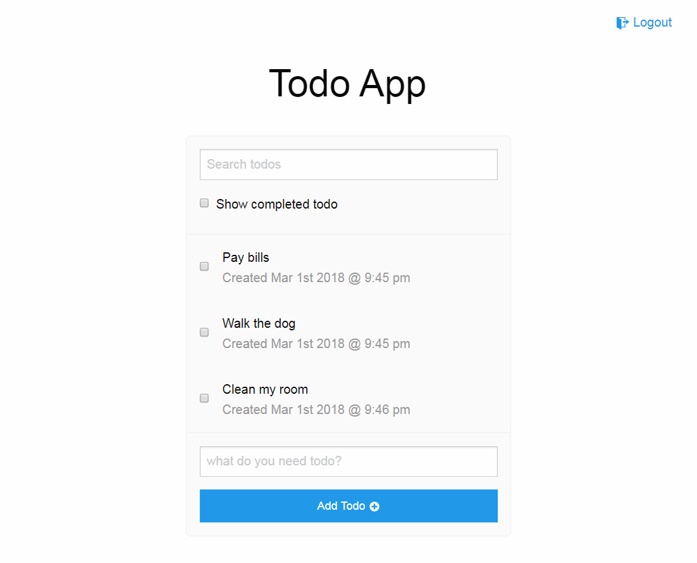
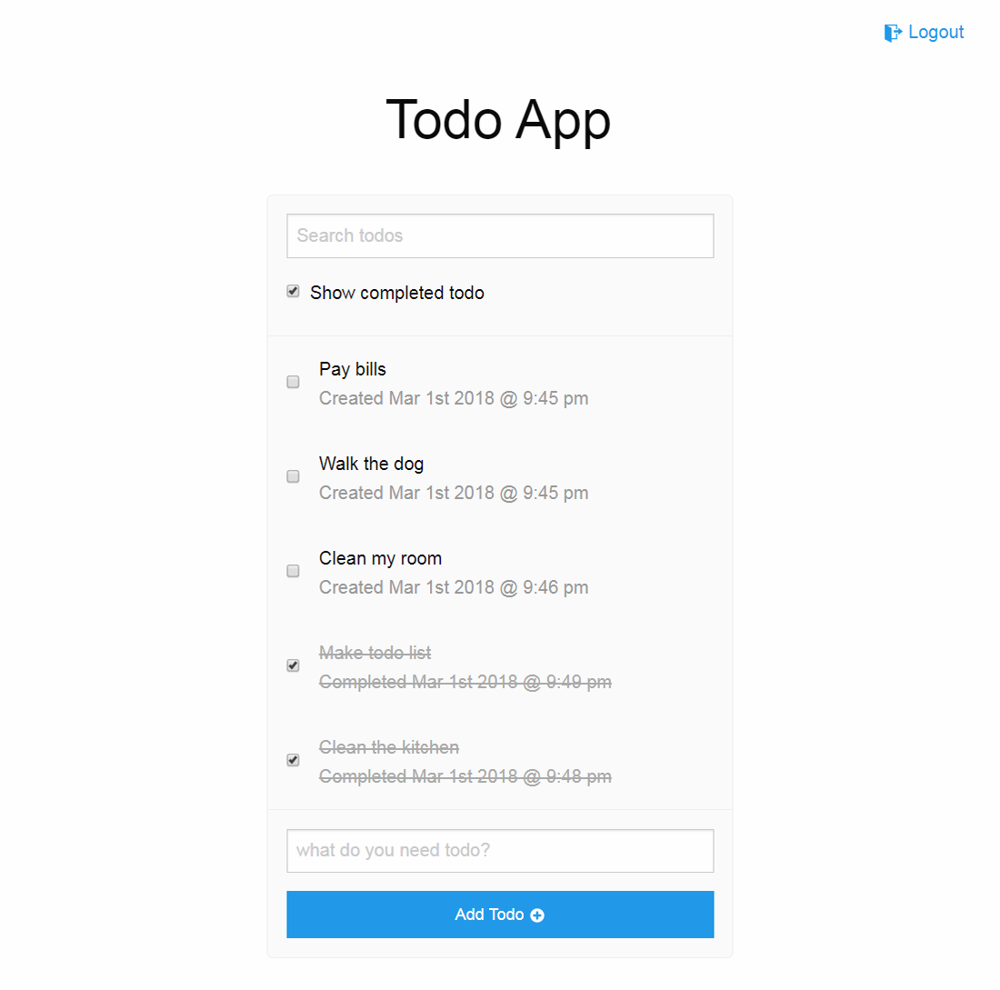
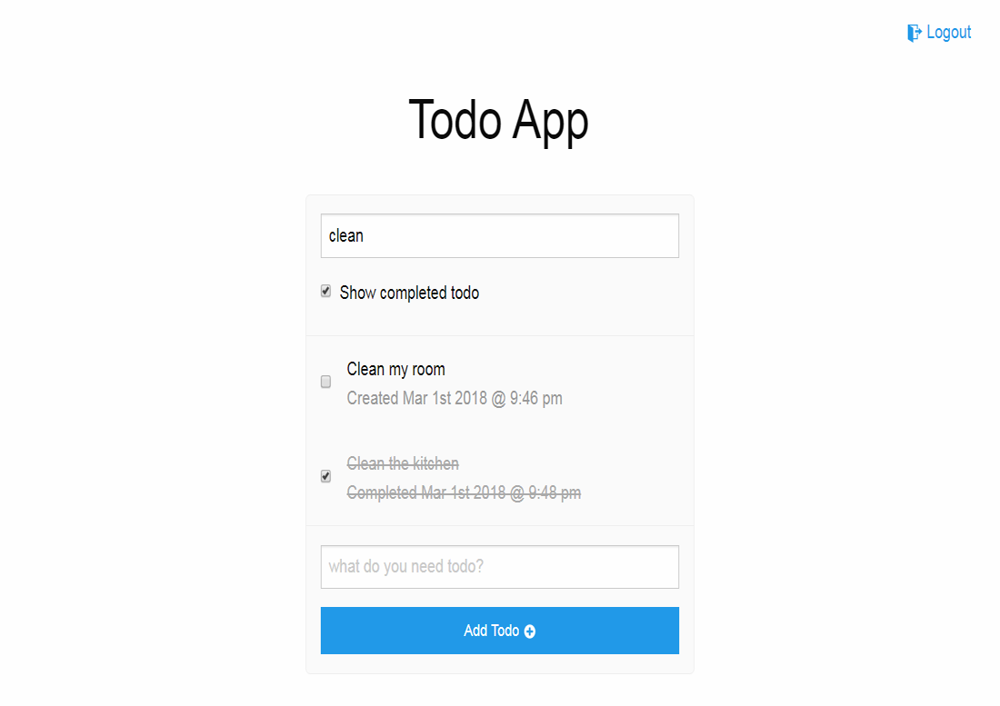

# React Todo App
## 描述
### 參與Udemy上的線上課程**The Complete React Web App Developer Course**，實作React Todo App，並部署到Heroku。使用者需用GitHub帳號登入，登入後只能看見自己所儲存的Todo清單，可進行新增，以及完成的勾選，下次以同一帳號登入，仍能看見自己的資料。

## 使用
+ React、 Redux、 React-Router
+ Webpack
+ HTML、CSS(SCSS)、Foundation
+ JavaScript、jQuery and JavaScript ES6 feature
+ Google Firebase
+ Heroku

## 檢視
+ 登入畫面

+ 主畫面

+ 新增Todo項目

+ 顯示完成的Todo項目

+ 關鍵字搜尋Todo項目

## Demo
React Todo App [Link](https://warm-badlands-15217.herokuapp.com)
